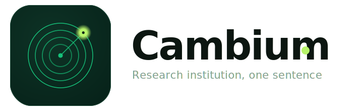

<div align="center">

<picture>
  <source media="(prefers-color-scheme: dark)" srcset="assets/logo-dark.svg">
  
</picture>

[](LICENSE)
[](https://claude.ai)
[](INSTITUTE.md)
[](AI_GOVERNANCE.md)
[](.github/workflows/validate.yml)
[](https://github.com/IFC-UIDAHO/Cambium_AI/pulls)

<h1 align="center">Cambium</h1>

### A research institution you run with one sentence — from RFP to verified results, with a human in the loop at every gate.


**45 specialized agents · 11 councils · the full research lifecycle · governed at every gate.**

*Cambium is the thin living layer just under a tree's bark — the place where new growth actually forms.
This Cambium is the layer where your research grows: a portable Claude project that acts as your entire
research org — agents handle grant intake, brainstorming, proposal writing, development, adversarial
verification, and reporting.* **Every claim carries an evidence tier; every phase boundary needs your
approval; nothing is published, submitted, or edited without you.** Copy `.claude/agents/`, keep the
protocol files, point it at any project.

▶ **See it move:** open [`demo/tour.html`](demo/tour.html) (a 60-second self-running tour) · or
[`dashboard.html`](dashboard.html) (interactive org chart) · or [`index.html`](index.html) (landing site).
<br><sub>Created by M. Jaslam (University of Idaho · Intermountain Forestry Cooperative) · MIT licensed · works whether you're starting a proposal, mid-project, or writing reports.</sub>

</div>

---

## What it is

Cambium turns a Claude project into a **research organization**. You are the **Director (PI)**: you set
direction and approve at every gate. A **Provost (Orchestrator)** dispatches specialists; **Scouts, Labs,
Verification boards, and Execution labs** do the science; a **Faculty** of domain experts advises; a
**Pre-Award Office** wins grants; a **Partnerships Office** finds and contacts collaborators; a
**Reporting Office** produces progress/annual reports and decks; and a **Document Office** writes the
final deliverable — *only from verified findings, only after you approve.* It works for **any field** and
at **any stage** of a project.

## Why it's different from a pile of prompts

- **Verification runs code.** The audit boards don't opine — they execute your scripts and reproduce
  the numbers. That's what catches leakage, unfair baselines, and mis-stated claims.
- **One output contract, one ledger.** Every agent emits the same five fields with a **severity**
  (P0/P1/P2) and a **claim tier** (Proved / Code-verified / Asserted / Open). 45 agents merge into one
  decision because they all speak the same format. Conflicts resolve by: *whoever ran the code wins.*
- **Smart-Tier models.** Opus only where deep adversarial reasoning pays (theory + the audit boards);
  Sonnet where it's sufficient; your main model for synthesis and final writing. Best result per token.
- **Governed by construction.** Ships an [`AI_GOVERNANCE.md`](AI_GOVERNANCE.md) policy (research +
  teaching: authorship/disclosure, FERPA, IRB, data sovereignty, dual-use), a recorded human-approval
  ledger ([`governance/GATES.md`](governance/GATES.md)), and a runnable
  [`governance/validate.py`](governance/validate.py) that **fails the build on an open P0 or an
  un-evidenced claim** — turning the honesty contract from convention into a check. *No comparable
  research-agent system ships a governance policy.*
- **Human-in-the-loop, always.** No email sent, no proposal submitted, no report released, no claim
  beyond its evidence — without you.

## At a glance


*Diagrams render natively on GitHub (no JS). Interactive version: [`dashboard.html`](dashboard.html) · 60-second tour: [`demo/tour.html`](demo/tour.html) · live site: [`index.html`](index.html).*

## How we compare

| System | Scope | Human gates | Evidence contract | Governance policy |
|---|---|---|---|---|
| **Cambium** | **RFP → proposal → development → verified results → reports** | **8 mandatory; nothing ships without you** | **Claim-tier contract; CI fails on un-evidenced claim** | **Shipped & enforced** |
| Sakana AI Scientist | Idea → ML paper | None (autonomous) | ML experiments; no cross-agent contract | None |
| Google AI Co-Scientist | Hypothesis generation | Review step; no formal gates | Elo-ranked ideation; no code verification | None |
| Agent Laboratory | Lit → experiments → report (ML) | Co-pilot checkpoints (informal) | Runs ML code; no unified contract | None |
| AutoGen / CrewAI | General orchestration substrate | Optional; not opinionated | Framework only | None |

The only system that spans the **full pre-award and post-award lifecycle** under one human-governed evidence contract with a shipped, enforceable governance policy. **[Full, honest comparison →](COMPARISON.md)** (includes where competitors excel, with verified sources).

## Start where you are

| You are… | Do this | Reads |
|---|---|---|
| **Starting from scratch (an RFP/call)** | `read rfp <file/link>` → `brainstorm` → `draft proposal` | [GETTING_STARTED](GETTING_STARTED.md#a-from-scratch) |
| **Already awarded / mid-project** | `project approved` → `run lab` (develop → verify → synthesize) | [GETTING_STARTED](GETTING_STARTED.md#b-mid-project) |
| **In the writing / reporting phase** | `progress report` / `annual report` / `make deck` | [GETTING_STARTED](GETTING_STARTED.md#c-reporting) |

## Install (two ways)

**A. Template repo (simplest).** Click **“Use this template”** on GitHub (or clone), then copy
`.claude/agents/` into your project. Open `dashboard.html` to see the org. Say a trigger phrase.

**B. Plugin.** Add the marketplace and install:
```
/plugin marketplace add IFC-UIDAHO/Cambium_AI
/plugin install cambium-institute
```
(See [`plugin/`](plugin/) for the manifest and `marketplace.json`.)

## The 11 councils

Office of the Director (you) · Provost/Orchestration · **Pre-Award Office** · **Partnerships Office** ·
**Faculty** · Scouts · Labs · Verification · Execution · Support Staff · **Reporting Office** · **Governance**.
Full charter: [`INSTITUTE.md`](INSTITUTE.md). Roster: [`.claude/agents/`](.claude/agents).

## Commands

| Say… | What runs |
|---|---|
| `new project: <name>` | open + register a project folder |
| `read rfp <file/link>` | RFP-Analyst → requirements brief → **Gate G1** |
| `brainstorm` | Ideation + Faculty → ranked idea slate → **Gate G2** |
| `convene faculty <fields>` | summon discipline experts to review/contribute |
| `draft proposal` | PI aims + Proposal-Writer → full draft → **Gate G3** |
| `find collaborators <categories>` | Collaborator-Scout → verified candidate list |
| `project approved` | flip to Development, start the engine |
| `run lab` / `run verification` | the Development Playbook (build → verify → synthesize → revise) |
| `progress report` / `annual report` / `make deck` | Reporting Office → **Gates G5/G6** |

## Make it your lab's — and your whole team's

Rename and configure in `config.yml` (lab name, model profile, protected files). The agents are
domain-neutral — your **field expertise lives in the Faculty** (summon any discipline), so the same
framework serves a forestry lab, a genomics lab, or an economics lab without edits.

It's built for a **team, not one person.** Define your roster in `config.yml` — **Director (PI)**, **Co-PIs /
Area Leads**, **Project Manager**, **Researchers/Students**, **Engineers** — and the per-gate approver map.
Then **each PI/Co-PI is the human-in-the-loop for their own sector**: a Co-PI approves the fixes and
reports for their Aim (G4/G5), the Director owns submission and publication (G3/G6), the PM runs ops, and
the Verification boards stay independent. Approvals are recorded in `governance/GATES.md`. Full model:
[`ROLES.md`](ROLES.md) · printable per-role card: [`TEAM_QUICKSTART.md`](TEAM_QUICKSTART.md).

## Docs

[`GETTING_STARTED.md`](GETTING_STARTED.md) · [`INSTITUTE.md`](INSTITUTE.md) (charter) ·
[`DEVELOPMENT_PLAYBOOK.md`](DEVELOPMENT_PLAYBOOK.md) · [`OUTPUT_CONTRACT.md`](OUTPUT_CONTRACT.md) ·
[`FACULTY_ROSTER.md`](FACULTY_ROSTER.md) · [`ROLES.md`](ROLES.md) · [`TEAM_QUICKSTART.md`](TEAM_QUICKSTART.md) ·
[`SKILLS_MAP.md`](SKILLS_MAP.md) · [`AI_GOVERNANCE.md`](AI_GOVERNANCE.md) ·
[`AI_USE_STATEMENT.md`](AI_USE_STATEMENT.md) · [`SECURITY.md`](SECURITY.md) ·
[`CODE_OF_CONDUCT.md`](CODE_OF_CONDUCT.md) · [`CONTRIBUTING.md`](CONTRIBUTING.md) · [`examples/`](examples).

## More

[`LIFECYCLE_V3.md`](LIFECYCLE_V3.md) (end-to-end map) · [`RESEARCH_CONDUCT.md`](RESEARCH_CONDUCT.md) (responsible-research standard) · [`CAMBIUM_V3.md`](CAMBIUM_V3.md) ·
[`COMPARISON.md`](COMPARISON.md) (vs other systems) · [`FAQ.md`](FAQ.md) · [`ROADMAP.md`](ROA