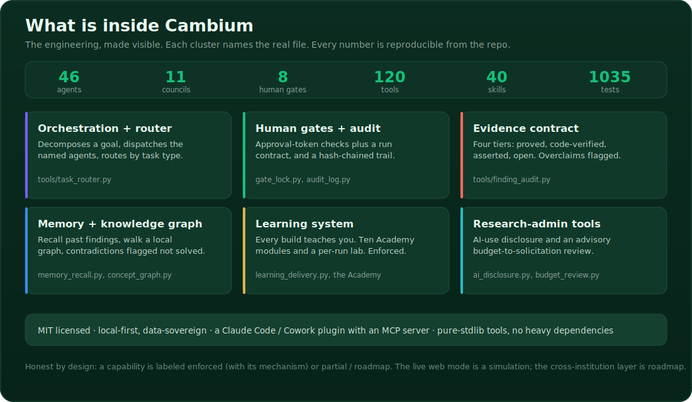
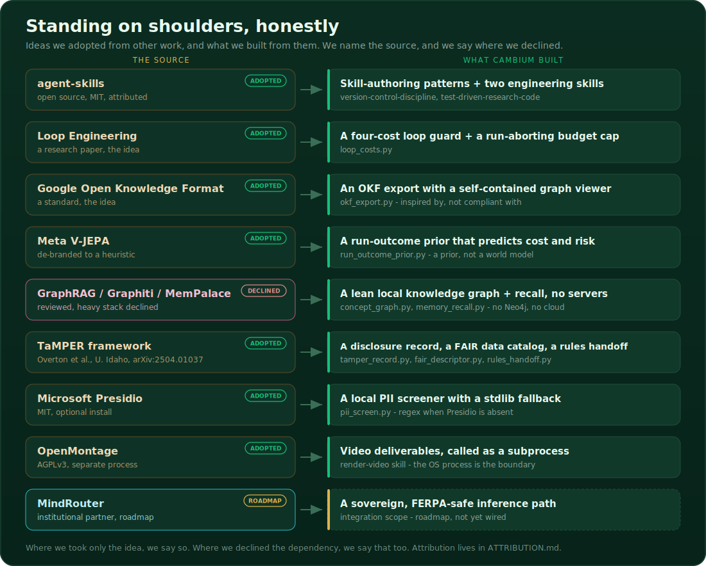

<div align="center">


<br>

<a href="https://github.com/pkjaslam/Cambium_AI/actions"></a>
<a href="CHANGELOG.md"></a>


<h3>Let AI handle the volume. Keep a human responsible for every result.</h3>

<em>Cambium gives one researcher a whole institute of AI specialists to scout, draft, and check, then stops at human checkpoints so a person, not a model, makes the calls that matter.</em>

</div>

---

## In one minute

Cambium is a research institute you run on your own machine. You give it a goal in plain language, it spins up the named specialists the job needs, and it walks the work from a funding call to a checked result. It stops at human gates so you, not a model, own every decision that counts.

- One sentence in, a real research process out: scouts, labs, an independent verification board, reporting, and governance, coordinated by an orchestrator.
- Honesty is plumbing, not a promise. Every concern about AI in research is wired to something that runs: a check in CI, a gate a person signs, a rule that stops the work before it ships.
- It teaches you as it goes. Every build produces a learning packet, and the Cambium Academy turns the core ideas into ten interactive modules.
- It is a Claude Code and Cowork plugin with an MCP server. Any field, MIT-licensed, runs in your own account with no third party in the middle.

---

## Why Cambium exists

AI can read a thousand papers, draft a proposal, and run an analysis before lunch. It can also make claims it can't back up, cite papers that were never written, move faster than your judgment can keep up with, and quietly end up authoring the science it was only supposed to help with. In most settings that just wastes time. In research it corrupts the record, and that is a lot harder to undo.

Most tools answer this worry with a policy page. Cambium answers it with plumbing. Every concern people raise about AI in research is wired to something that actually runs.

<div align="center">

</div>

> Cambium keeps coming back to one rule: use AI to expand what a lab can do, but keep a human responsible for whether the work is valid, ethical, and right. Where a control is fully enforced, this README says so. Where it is real but not yet airtight, it says "partial," because overclaiming is the exact thing the project is trying to stop. The longer version lives in [`VISION.md`](docs/concepts/VISION.md) and the ten-point [`AI_POLICY.md`](docs/governance/AI_POLICY.md).

---

## Who it is for

| Audience | What Cambium offers |
|---|---|
| **Researchers and PIs** | Run a project end to end, from RFP to publish, with a human at every gate and a named agent for every role |
| **Research administrators and sponsored programs** | Pre-award proposal drafting, an advisory budget-to-solicitation review that flags issues against funder rules, and an AI-use disclosure builder for federal proposals (addresses NIH NOT-OD-25-132 and similar requirements) |
| **Developers and contributors** | A Claude Code / Cowork plugin with an MCP server, 54+ stdlib tools, a full test suite, and clean extension points for new councils and skills |
| **Institutions and funders** | MIT-licensed, local-first, data-sovereign; every gate decision is logged to a markdown ledger that any auditor can read without special tooling |
| **Educators and learners** | An interactive Academy with ten modules across three tiers, plus a per-run Learning Lab generated automatically at the close of every build |

---

## See it run

When a run starts, the institute comes to life in the chat. Agents wake up, do their piece, and report back. Then the whole thing pauses at a gate and waits for you.

<div align="center">

</div>

<div align="center"><sub>Illustrative run. The numbers shown are representative, not from a real study.</sub></div>

---

## Get going in a minute

```bash
# 1) Add the marketplace and install the plugin (Claude Code or Cowork)
/plugin marketplace add pkjaslam/Cambium_AI
/plugin install cambium-institute

# 2) Try it with no setup. A full plan, no API key, no calls.
/cambium run example

# 3) Run your own task the Cambium way
/cambium draft an NSF proposal on soil-carbon monitoring in dryland systems
```

That is the whole setup. `/cambium` draws a live board of the institute working, sends in the real agents, and stops at each gate with a clickable Approve, Revise, or Reject card. If you just want speed, `/cambium-mode` drops any task down to solo, with no councils and no gates.

**Where it stores run data.** Cambium keeps its run state, boards, and records with your project, never inside the installed plugin (which is read-only). By default that is the repo when you are developing from a clone, or a `.cambium/` folder in the directory you run from. To put it somewhere specific, set the `CAMBIUM_HOME` environment variable and everything Cambium writes goes there.

---

## Telling it what you want

| You want to | Say |
|---|---|
| See the whole institute run a task | `/cambium <your task>` |
| Try it with no setup | `/cambium run example` |
| Read a funding call and decide if it fits | `/cambium read this RFP: <link or text>` |
| Turn approved aims into a proposal | `/cambium draft the proposal` |
| Build and verify a method | `/cambium run the lab` |
| Stress-test a result or a claim | `/cambium verify this: <result>` |
| Write a progress or annual report | `/cambium write the quarterly report` |
| Go fast, skip the gates | `/cambium-mode`, then solo |

---

## The lifecycle, and the eight gates

Cambium covers the whole life of a project, and it puts a human checkpoint everywhere a real decision gets made. The gates aren't there to slow you down. They are where accountability actually lives.

<div align="center">

</div>

| Gate | Where | What you decide |
|---|---|---|
| **G0** | Intake | Is this worth the institute's time? |
| **G1** | Pre-award | Do we pursue this direction or RFP? |
| **G2** | Design | Which approach moves forward? |
| **G3** | Submit | Finalize and submit. Director only, no AI self-certify. |
| **G3a** | Budget | Budget and compliance sign-off. |
| **G4** | Results | Accept the results, after every number is reproduced. |
| **G5** | Report | Do we release the report? |
| **G6** | Publish | Do we go public? |

At each gate the run stops, shows you a one-page summary, and waits. A quick "looks fine" doesn't get through. The Learning Gate asks for a real contribution from you, and the system spaces out back-to-back decisions so you can't rubber-stamp a project at full speed.

Human gates are enforced by approval-token checks (in `tools/gate_lock.py`) and the run contract in each agent's prompt. They are not a hard pipeline halt in the sense of an OS-level lock; a determined user could bypass them. The contract is prompt-level plus logged: every gate decision is written to the contribution ledger and the audit log, so the record is clear.

---

## How it's put together

One Orchestrator. Eleven councils. Forty-six specialists, each good at one thing, and none of them grading their own homework. The verification board is independent, and whoever wrote something is never the person who approves it.

<div align="center">

</div>

The councils are Orchestration, Pre-Award, Partnerships, Faculty, Scouts, Labs, Verification, Execution, Reporting, Support, and Governance. The Orchestrator breaks down your goal, calls in only the councils the task needs, runs them in parallel where it can, merges what comes back into one ranked decision, keeps the findings ledger, and runs the gates. You can always see which named agent is working, and on what.

---

## What we engineered

This is where the work lives. The engineering is traceable to specific files.

<div align="center">

</div>

**Orchestration and task routing.** The Orchestrator calls the right councils for each task and merges what comes back. The task router (`tools/task_router.py`) maps incoming requests to council sets and handles parallel dispatch. The run-board tools (`tools/gen_inline_board.py`, `tools/gen_board_pro.py`) render a live agent board in-chat and as a standalone HTML file, so you can always see which agent is active and what it found.

**Human-gate machinery and the audit trail.** Gate logic lives in `tools/gate_lock.py`, which writes approval tokens to the run ledger and blocks downstream steps until they are present. The contribution ledger (`governance/GATES.md`) records every gate decision: who approved, when, and what the summary said. `tools/audit_log.py` appends a structured entry for every significant agent action. Records are plain markdown, not cryptographically signed, and the enforcement is prompt-level plus token-checked, not a hard OS lock.

**Four-tier evidence contract and integrity audit.** Every claim in a run output carries a tier: Proved, Code-verified, Asserted, or Open. `governance/validate.py` checks submitted ledger entries against the evidence contract and fails the build if a claim exceeds its evidence. It does not auto-verify claims mid-run; it checks what agents submitted against the rules after the fact. `tools/finding_audit.py` audits the full findings ledger for tier consistency and flags open items.

**Memory and a local knowledge graph.** `tools/memory_recall.py` stores and retrieves session context from a gitignored cache. `tools/concept_graph.py` builds a fully-local knowledge graph over Cambium's own curated records (findings, gates, agents, concepts) using typed edges. Multi-hop queries (neighbors, shortest path, what-supports, what-contradicts) work on top of it. The graph uses networkx when present and a pure-stdlib adjacency fallback otherwise. No external database is required; the graph lives with the project. Writable caches are routed through `data_home()` in `tools/cambium_io.py` so an installed (read-only) plugin writes to the user's project directory, not into the plugin itself.

**Learning system.** `tools/learning_delivery.py` generates a per-run learning brief and enforces the Learning Gate: a build or analysis run cannot close without producing one. `tools/gen_learning_lab.py` produces an interactive per-run Learning Lab as a self-contained HTML file. The Cambium Academy (`academy/index.html`) is ten interactive modules across three tiers, built on evidence-based instructional design: predict-first, spaced repetition, explain-it-back.

**Research-administration tools.** `tools/ai_disclosure.py` assembles an AI-use disclosure and audit summary from records Cambium already keeps (gate decisions, approvers, which agents ran). It documents what AI did and that a human signed off; it does not certify compliance. `tools/budget_review.py` is a deterministic budget-to-solicitation review that flags issues (F&A cap, cost ceiling, period, required sections, disallowed categories, cost-share) against a solicitation-rules file. Both are advisory by design: the final call stays with a human in sponsored programs.

---

## Skills and features: built and adopted

Cambium is honest about what is original engineering and what borrows from prior work.

### Built in-house

- The council architecture and the named specialist agents (46 agents across 11 councils, each scoped to one role)
- The task router and Orchestrator dispatch logic
- The gate machinery: approval-token checks, the contribution ledger, the audit log
- The four-tier evidence contract as an integration: the tier system, the CI validator, and the finding audit
- Memory and the local knowledge graph: session recall plus a structured, multi-hop-queryable graph over run records, deliberately lightweight and dependency-minimal
- The learning system: per-run Learning Lab generation, the enforced Learning Gate, and the ten-module Academy
- The writable-data resolver (`data_home()`) that makes the plugin work as a read-only install without breaking run state
- The research-administration tools: AI-use disclosure builder and the deterministic budget reviewer

### Adopted, with attribution

- **Skill-authoring structure** (anatomy of a SKILL.md file: trigger-rich description, numbered process, anti-rationalization table, exit criteria, red flags): structural patterns adapted from [addyosmani/agent-skills](https://github.com/addyosmani/agent-skills) (MIT). Two engineering skills were also adapted from that repository. No verbatim files were copied. Full credit in [`ATTRIBUTION.md`](ATTRIBUTION.md).
- **Four-cost loop guard** (`tools/loop_costs.py`): the four silent costs of autonomous loops (verification debt, comprehension rot, cognitive surrender, token blowout) are a framing drawn from Loop Engineering research. The implementation is ours.
- **Open Knowledge Format export** (`tools/okf_export.py`): portable run-findings bundles inspired by Google's OKF format. Plain markdown with YAML frontmatter, cross-linked, with a self-contained graph viewer.
- **Run-outcome prior** (`tools/run_outcome_prior.py`): a heuristic prior that predicts a run's likely cost and risk from past run history, inspired by V-JEPA-style world-model framing. It is a prior, not a learned world model, and it refuses to fabricate a risk rate on a small sample.
- **Local knowledge graph design** (`tools/concept_graph.py`): built after reviewing GraphRAG, Graphiti, MemPalace, and LightRAG and deliberately not adopting any of them. GraphRAG needs a cloud LLM per query, Graphiti and Neo4j need a running database, and all of them break the git-auditable guarantee. Cambium's graph uses networkx when available and a pure-stdlib fallback otherwise.
- **Render-video** (`skills/render-video`): calls the separately-installed OpenMontage tool (AGPLv3) across a process boundary. OpenMontage is not bundled; it must be installed by the user. The process boundary keeps Cambium's MIT license clean.

<div align="center">

</div>

---

## Responsible AI, built in

The honesty here isn't a tone of voice. It's closer to a type system for claims. Every factual statement an agent makes has to carry a tier, and CI ([`governance/validate.py`](governance/validate.py)) fails the build if a claim reaches past its evidence.

| Tier | What it means | Example |
|---|---|---|
| **Proved** | a theorem or formal proof | "the estimator is unbiased under A1 to A3" |
| **Code-verified** | a script ran and reproduced the number | "FCR is 0.33 (12/36), rerun hash recorded" |
| **Asserted** | claimed, not yet verified | "this approach should generalize" |
| **Open** | unknown or unresolved | "whether enforcement beats prompting is Open" |

Around that contract sit the controls from the diagram above. A citation that doesn't resolve is a release blocker, not a warning. A scanner watches for PII and regulated data. A bias checklist (NIST AI RMF) has to be done before the results gates. A pace check keeps decisions from stacking up. An audit trail records every turn, and a named human signs every gate in [`governance/GATES.md`](governance/GATES.md).

Not every check needs to trust a model, and we say which ones do. Right now 10 of 16 verification checks are grounded in something a skeptic can verify without any LLM: arithmetic that either sums or it doesn't, a citation or DOI that either resolves or it doesn't, against OpenAlex, Crossref, and doi.org. The other 6 are the genuinely hard judgments where a model or a human still forms the call. The full split is in [`CHECKS.md`](governance/CHECKS.md).

We hold ourselves to the same standard. We graded Cambium against the field's ten most common worries, and it comes out 3 Leads, 6 Partial, 1 Gap. We left the Partials and the Gap in plain sight instead of rounding them up. The enforcement study we pre-registered and ran came back Open: we have not measured a real effect yet on a near-ceiling model, and we shipped the harness and the null rather than dressing it up. The details are in [`POSITIONING.md`](docs/governance/POSITIONING.md), [`evals/enforcement_study/`](evals/enforcement_study), and the live [evaluation dashboard](assets/benchmark_dashboard.html).

The live web mode (the FastAPI bridge in `web/server/app.py`) is the only web integration that has been verified end-to-end. The cinematic frontend and a broader simulation mode are roadmap, not built. Cross-institution shared infrastructure (SSO and RBAC) is also roadmap, listed honestly in [`ROADMAP.md`](docs/reference/ROADMAP.md).

---

## Capacity and strength

<!-- CAMBIUM:STATS -->
40 skills, 62 tools, 6 MCP tools, 19 templates, and a set of worked examples. All field-agnostic, all runnable.
<!-- /CAMBIUM:STATS -->

Those numbers reflect what is in the repo today. The skills cover the full research lifecycle from intake to publish, plus domain specialties (statistics, ML, optimization, health, citations, ethics). The tools cover orchestration, gating, evidence, memory, learning, research-administration, and self-grading. The MCP server exposes six core operations so any MCP-capable client can drive the institute. The templates give every project a consistent paper trail from RFP brief to closeout checklist.

What they enable: one researcher can run a structured, multi-agent, gate-controlled research project without writing any orchestration code. The councils handle parallelism. The gates handle accountability. The learning system means the work also teaches. The test suite confirms the machinery holds under changes.

---

## Learn by doing

A research institute should also teach. The [Cambium Academy](academy/index.html) is ten interactive modules across three tiers. The five Foundation modules cover the ideas you need to run the institute well: the Cambium way, evidence tiers and honest claims, why a human gate beats full autonomy, verifying a result without fooling yourself, and research ethics and data stewardship. On top of those sit Practitioner modules (grant writing, a data-stewardship workshop, reproducibility in practice) and Expert modules (designing custom agents, teaching research with Cambium).

The mechanics are borrowed from evidence-based instructional design: you predict before you see the answer, flip spaced-repetition flashcards, click through the architecture instead of staring at a wall of text, do a small change yourself, and explain each idea back in your own words. External "Go deeper" links point to real courses at Coursera, the Princeton leakage and reproducibility workshop, OHRP, and others. We link out to those, we don't copy them. Every run also produces a per-run Learning Lab, and teaching is enforced: a build or analysis run cannot close without delivering one.

Two honest limits worth knowing. The Practitioner badge is designed and wired to the course logic, but it does not yet mint automatically from a run's artifacts. And the spacing schedule is stored per browser, not per account, so if you switch devices mid-sequence you'll need to restart. Everything else runs today.

---

## How it stacks up

| | AI research assistants | Agent frameworks | **Cambium** |
|---|:--:|:--:|:--:|
| Named, specialized roles | no | partial | **46 across 11 councils** |
| Human gates that actually block | no | no | **8, signed (prompt-level + token-checked)** |
| Claims typed and CI-enforced | no | no | **four-tier evidence contract** |
| Citation, data, and bias controls | partial | no | **enforced at the gate** |
| Reproduces its own numbers | no | no | **verification board** |
| Runs in your account, MIT | partial | partial | **yes** |
| Honest about what it can't do | rare | rare | **publishes its Partials and the null** |

Cambium isn't trying to be a faster assistant. It's trying to be the part of the lab that keeps the science honest while the AI handles the volume.

---

## For teams

Multi-PI projects get named, institution-scoped approvers, so a gate won't pass unless the right Co-PI signs it ([`templates/MULTI_PI_ROLES.yml`](templates/MULTI_PI_ROLES.yml)). There's also a model router that sends the hard reasoning to the strongest model and routine work to a cheaper one. Shared infrastructure across institutions (SSO and RBAC) is the honest gap right now, and it's staged out in [`ROADMAP.md`](docs/reference/ROADMAP.md). For the office that actually has to approve this, there's a one-time institution profile (approved funders, data-handling rules, budget ceilings, named approvers) that the validator checks, plus a one-meeting governance approval packet a committee can read and sign. Both live in [`governance/institution/`](governance/institution/).

---

## Models and tokens

A common worry is that an institute of agents must be token-heavy. The direction is routing, not more spend. Frontier models handle the hard, gate-critical steps. Capable open models handle the routine bulk: summaries, formatting, drafts, retrieval. Most of the volume is the routine kind, and open models can run on your own machine, so most of the work never leaves your environment and never meters a token. The per-task router exists today; the frontier-plus-open mix is on the roadmap.

---

## What's next

Soon: actually run the v1 enforcement study, the powered, human-judged version. The task set, the rater tool, and the analysis are built and waiting on people and budget. After that, more work on reproducibility. Further out: shared infrastructure for multi-institution grants, and a cinematic web front-end that drives the same gated engine. Nothing reaches that list without the same evidence contract pointed back at it.

### Recent updates

<!-- CAMBIUM:WHATSNEW -->
- **1.29.0**: Full-stack AI engineer: nine engineering skills (gates G1, G4)
- **1.28.0**: UI/UX skill deepened from the best open design skills
- **1.27.0**: Web development and UI/UX design skills
<!-- /CAMBIUM:WHATSNEW -->

---

## Contributing and license

Contributions are welcome. Start with [`CONTRIBUTING.md`](CONTRIBUTING.md), which explains the branch-and-pull-request workflow and the pre-push checklist. Cambium is released under the [MIT License](LICENSE).

<div align="center">
<strong>Cambium</strong> &middot; MIT License &middot; Built with <a href="https://claude.ai">Claude</a> &middot; <span>Human-in-the-loop at every gate.</span>
</div>
