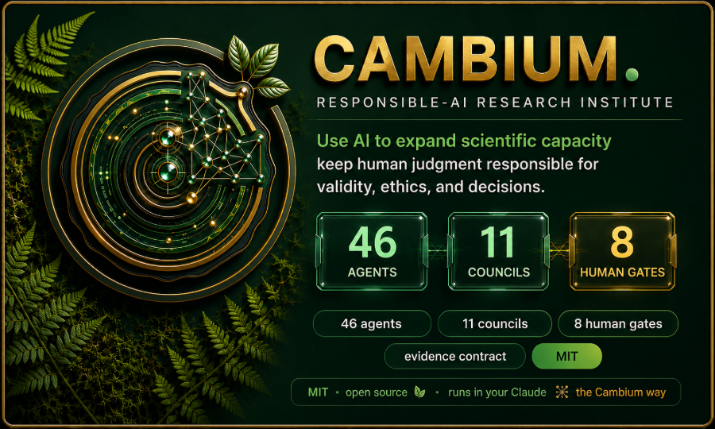
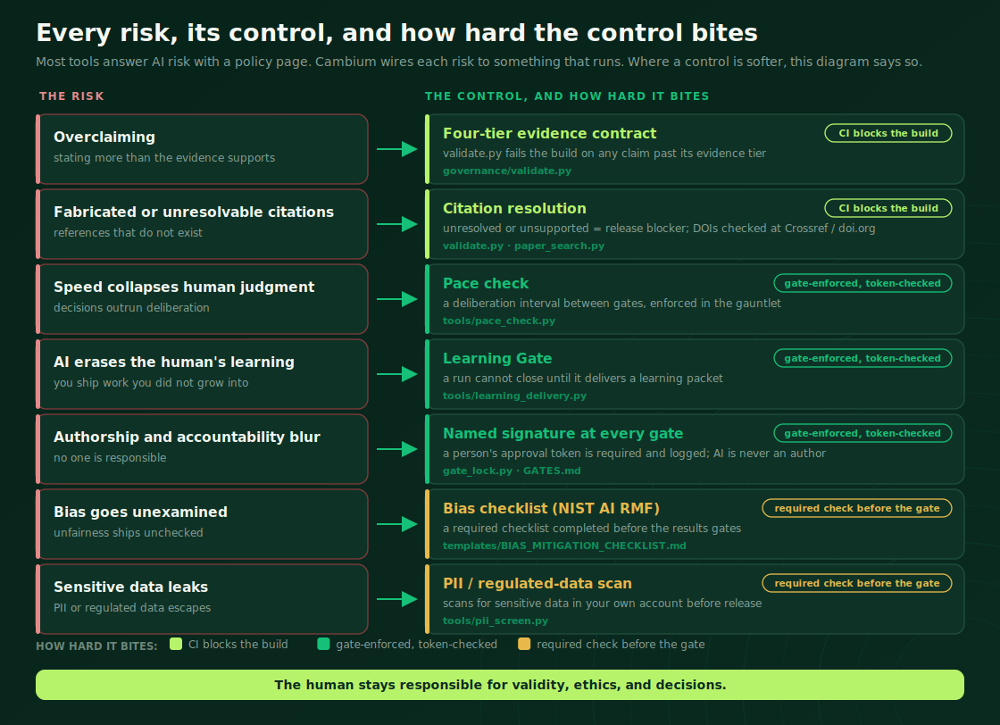
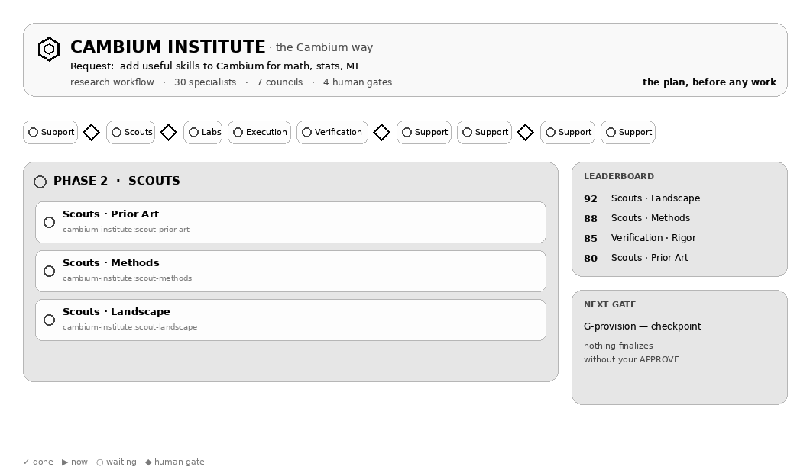
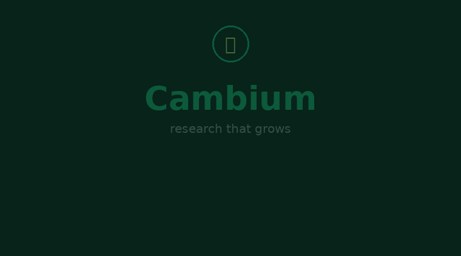
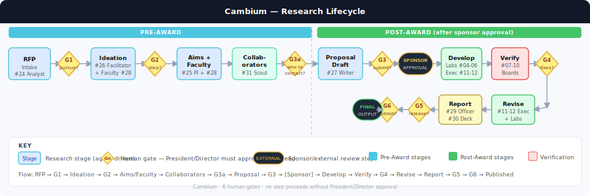
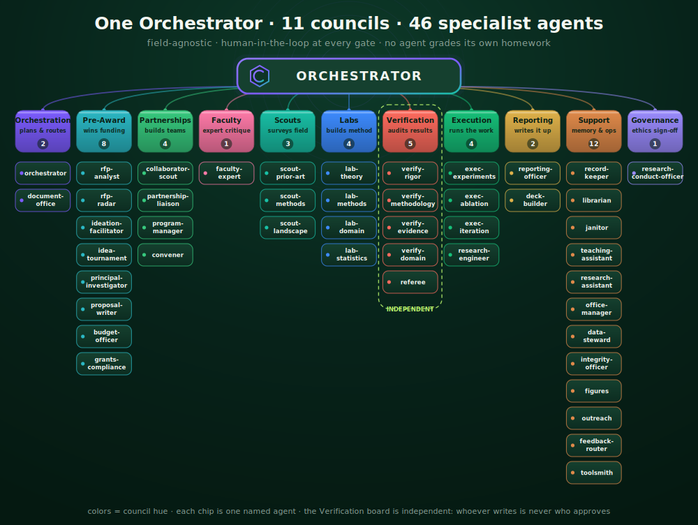

<div align="center">



<br>

<a href="https://github.com/IFC-UIDAHO/Cambium_AI/actions"></a>
<a href="CHANGELOG.md"></a>


<h3>Let AI do the work. Keep a human responsible for the science.</h3>

<em>Cambium turns one researcher into a whole institute of AI specialists, then stops at human checkpoints so a person, not a model, makes the calls that matter.</em>

</div>

---

## Why Cambium exists

AI can read a thousand papers, draft a proposal, and run an analysis before lunch. It can also make claims it can't back up, cite papers that were never written, move faster than your judgment can keep up with, and quietly end up authoring the science it was only supposed to help with. In most settings that just wastes time. In research it corrupts the record, and that is a lot harder to undo.

Most tools answer this worry with a policy page. Cambium answers it with plumbing. Every concern people raise about AI in research is wired to something that actually runs: a check in CI, a gate a person has to sign, a rule that stops the work before it ships.

<div align="center">

</div>

> Cambium keeps coming back to one rule: use AI to expand what a lab can do, but keep a human responsible for whether the work is valid, ethical, and right. Where a control is fully enforced, this README says so. Where it is real but not yet airtight, it says "partial," because overclaiming is the exact thing the project is trying to stop. The longer version lives in [`VISION.md`](VISION.md) and the ten-point [`AI_POLICY.md`](AI_POLICY.md).

---

## What it actually is

Cambium is a research institute you run on your own machine. You hand it a request, and it spins up an Orchestrator that pulls in the councils and named agents the job needs (scouts, labs, a verification board, reporting, governance) and walks the work from a funding call all the way to a checked result. Eight times along the way it stops and asks you to decide. Nothing gets submitted, released, or published unless you sign off on it.

Under the hood it's a Claude Code and Cowork plugin with an MCP server. It works in any field, it's MIT-licensed, and it runs in your own account with no third-party cloud sitting in the middle.

---

## See it run

When a run starts, the institute comes to life in the chat. Agents wake up, do their piece, and report back. Then the whole thing pauses at a gate and waits for you.

<div align="center">

</div>

<div align="center">

</div>

---

## Get going in a minute

```bash
# 1) Add the marketplace and install the plugin (Claude Code or Cowork)
/plugin marketplace add IFC-UIDAHO/Cambium_AI
/plugin install cambium-institute

# 2) Try it with no setup. A full plan, no API key, no calls.
/cambium run example

# 3) Run your own task the Cambium way
/cambium draft an NSF proposal on soil-carbon monitoring in dryland systems
```

That is the whole setup. `/cambium` draws a live board of the institute working, sends in the real agents, and stops at each gate with a clickable Approve, Revise, or Reject card. If you just want speed, `/cambium-mode` drops any task down to solo, with no councils and no gates.

---

## Telling it what you want

| You want to | Say |
|---|---|
| See the whole institute run a task | `/cambium <your task>` |
| Try it with no setup | `/cambium run example` |
| Read a funding call and decide if it fits | `/cambium read this RFP: <link or text>` |
| Turn approved aims into a proposal | `/cambium draft the proposal` |
| Build and verify a method | `/cambium run the lab` |
| Stress-test a result or a claim | `/cambium verify this: <result>` |
| Write a progress or annual report | `/cambium write the quarterly report` |
| Go fast, skip the gates | `/cambium-mode`, then solo |


---

## The lifecycle, and the eight gates

Cambium covers the whole life of a project, and it puts a human checkpoint everywhere a real decision gets made. The gates aren't there to slow you down. They are where accountability actually lives.

<div align="center">

</div>

| Gate | Where | What you decide |
|---|---|---|
| **G0** | Intake | Is this worth the institute's time? |
| **G1** | Pre-award | Do we pursue this direction or RFP? |
| **G2** | Design | Which approach moves forward? |
| **G3** | Submit | Finalize and submit. Director only, no AI self-certify. |
| **G3a** | Budget | Budget and compliance sign-off. |
| **G4** | Results | Accept the results, after every number is reproduced. |
| **G5** | Report | Do we release the report? |
| **G6** | Publish | Do we go public? |

At each gate the run stops, shows you a one-page summary, and waits. A quick "looks fine" doesn't get through. The Learning Gate asks for a real contribution from you, and the system spaces out back-to-back decisions so you can't rubber-stamp a project at full speed.

---

## How it's put together

One Orchestrator. Eleven councils. Forty-six specialists, each good at one thing, and none of them grading their own homework. The verification board is independent, and whoever wrote something is never the person who approves it.

<div align="center">

</div>

The councils are Orchestration, Pre-Award, Partnerships, Faculty, Scouts, Labs, Verification, Execution, Reporting, Support, and Governance. The Orchestrator breaks down your goal, calls in only the councils the task needs, runs them in parallel where it can, merges what comes back into one ranked decision, keeps the findings ledger, and runs the gates. You can always see which named agent is working, and on what.

---

## Responsible AI, built in

The honesty here isn't a tone of voice. It's closer to a type system for claims. Every factual statement an agent makes has to carry a tier, and CI ([`governance/validate.py`](governance/validate.py)) fails the build if a claim reaches past its evidence.

| Tier | What it means | Example |
|---|---|---|
| **Proved** | a theorem or formal proof | "the estimator is unbiased under A1 to A3" |
| **Code-verified** | a script ran and reproduced the number | "FCR is 0.33 (12/36), rerun hash recorded" |
| **Asserted** | claimed, not yet verified | "this approach should generalize" |
| **Open** | unknown or unresolved | "whether enforcement beats prompting is Open" |

Around that contract sit the controls from the diagram above. A citation that doesn't resolve is a release blocker, not a warning. A scanner watches for PII and regulated data. A bias checklist (NIST AI RMF) has to be done before the results gates. A pace check keeps decisions from stacking up. An audit trail records every turn, and a named human signs every gate in [`governance/GATES.md`](governance/GATES.md).

We hold ourselves to the same standard. We graded Cambium against the field's ten most common worries, and it comes out 3 Leads, 6 Partial, 1 Gap. We left the Partials and the Gap in plain sight instead of rounding them up. The enforcement study we pre-registered and ran came back Open, which means we haven't measured a real effect yet on a near-ceiling model, and we shipped the harness and the null rather than dressing it up. The details are in [`POSITIONING.md`](POSITIONING.md), [`evals/enforcement_study/`](evals/enforcement_study/), and the live [evaluation dashboard](assets/benchmark_dashboard.html).

---

## What's in the box

23 skills, 41 tools, 6 MCP tools, 15 templates, and a set of worked examples. All field-agnostic, all runnable.

- **Skills** are the verbs: `/cambium`, `rfp-intake`, `proposal`, `run-lab`, `verification`, `reporting`, `budget`, `statistics`, `citations`, `data-management`, `reproducibility`, `research-ethics`, and more. If a task needs expertise that isn't there yet, the skill-provisioner grows it on the spot.
- **Tools** are the machinery, from a terminal or over MCP: the run board, the gate interlock, the evidence validator, the pace and data checks, the enforcement gauntlet, the self-grading `doctor`, and the A/B study harness.
- **The MCP server** lets you drive the whole institute from any MCP-capable client.
- **Governance** holds `VISION.md`, `AI_POLICY.md`, `POSITIONING.md`, the gates ledger, and rule packs for NSF, NIH, USDA-AFRI, and DOE.

---

## How it stacks up

| | AI research assistants | Agent frameworks | **Cambium** |
|---|:--:|:--:|:--:|
| Named, specialized roles | no | partial | **46 across 11 councils** |
| Human gates that actually block | no | no | **8, signed** |
| Claims typed and CI-enforced | no | no | **four-tier evidence contract** |
| Citation, data, and bias controls | partial | no | **enforced at the gate** |
| Reproduces its own numbers | no | no | **verification board** |
| Runs in your account, MIT | partial | partial | **yes** |
| Honest about what it can't do | rare | rare | **publishes its Partials and the null** |

Cambium isn't trying to be a faster assistant. It's trying to be the part of the lab that keeps the science honest while the AI handles the volume.

---

## For teams

Multi-PI projects get named, institution-scoped approvers, so a gate won't pass unless the right Co-PI signs it ([`templates/MULTI_PI_ROLES.yml`](templates/MULTI_PI_ROLES.yml)). There's also a model router that sends the hard reasoning to the strongest model and routine work to a cheaper one. Shared infrastructure across institutions (SSO and RBAC) is the honest gap right now, and it's staged out in [`ROADMAP.md`](ROADMAP.md).

---

## Models and tokens

Does running a whole institute burn a lot of tokens? The honest answer.

Today everything runs on Claude, on purpose. The work that matters here, judging evidence, catching overclaims, reproducing numbers, signing gates, is where a strong model pays for itself.

The direction is routing, not more spend. Frontier models handle the hard, gate-critical steps. Capable open models handle the routine bulk: summaries, formatting, drafts, retrieval. Most of the volume is the routine kind.

Open models from the major families can run on your own machine or cluster, so most of the work never leaves your environment and never meters a token, while a frontier model is saved for the calls that decide whether the science holds. The per-task router exists today; the frontier-plus-open mix is on the roadmap.

---

## What's next

Soon: actually run the v1 enforcement study, the powered, human-judged version. The task set, the rater tool, and the analysis are built and waiting on people and budget. After that, more work on reproducibility. Further out: shared infrastructure for multi-institution grants, and a cinematic web front-end that drives the same gated engine. Nothing reaches that list without the same evidence contract pointed back at it.

---

## License and credit

MIT, from the Cambium contributors and the University of Idaho IFC. If Cambium helps your work, a citation to the repository is appreciated. It's built on Claude Code and the Claude Agent SDK, and it isn't affiliated with or endorsed by Anthropic.

<div align="center"><br><em>Cambium. Research that grows, responsibly.</em></div>
