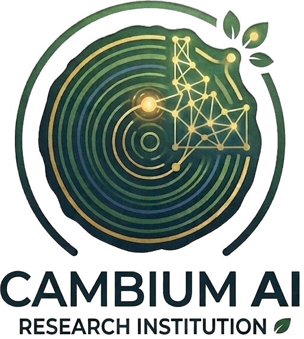
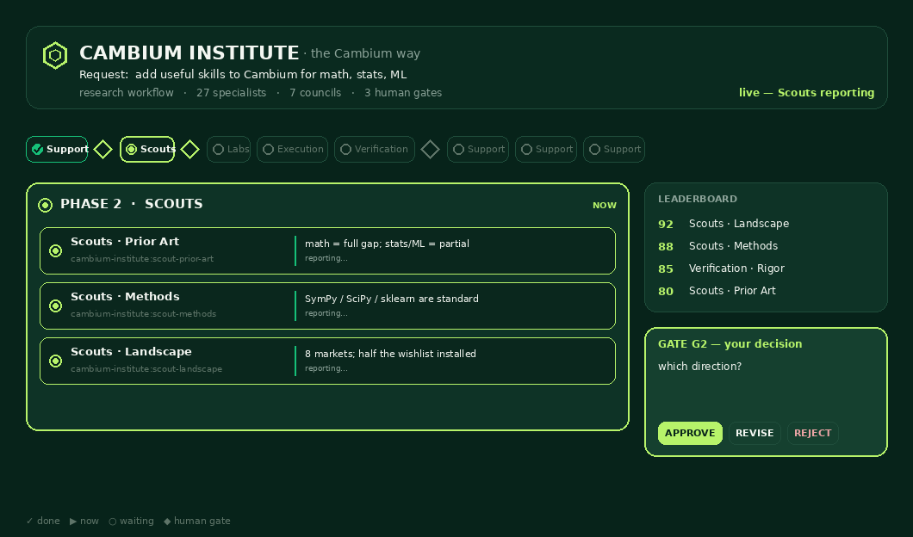
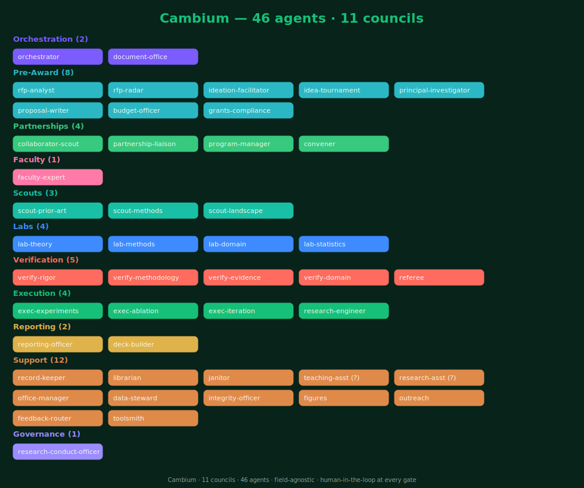

<div align="center">

<picture>
  <source media="(prefers-color-scheme: dark)" srcset="assets/logo-dark.png">
  
</picture>

<h1>Cambium</h1>

<p><b>A research institution you run with one sentence</b> — from the funding call to verified, funder-compliant results,<br>with a human in the loop at every gate.</p>

<p>
<a href="https://github.com/IFC-UIDAHO/Cambium_AI/actions/workflows/validate.yml"></a>
<a href="CHANGELOG.md"></a>
<a href="INSTITUTE.md"></a>
<a href="#-the-lifecycle--8-gates"></a>
<a href="MCP_INTEGRATION.md"></a>
<a href="LICENSE"></a>
</p>

<p><b>46 specialized agents · 11 councils · 8 human gates · 21 skills · 21 tools · a CI-enforced evidence contract</b></p>

<p>
<a href="#-why-it-stands-out">Why it stands out</a> ·
<a href="#-see-it-work">See it work</a> ·
<a href="#-60-second-quickstart">Quickstart</a> ·
<a href="#-how-to-use-it--what-to-say">How to use it</a> ·
<a href="#-the-architecture">Architecture</a> ·
<a href="#-full-capability-catalog">Capabilities</a> ·
<a href="#-governance--honesty-by-construction">Governance</a> ·
<a href="#-how-it-compares">Compare</a> ·
<a href="INSTALL.md">Docs</a>
</p>


</div>

---

## ✦ What Cambium is, in 10 seconds

Modern AI can draft a proposal, run an experiment, or write a paper. What it **cannot** do out of the box is run the *whole research organization* — pre-award through post-award — while keeping a person in command and keeping every claim honest.

> [!IMPORTANT]
> **Cambium turns Claude Code / Cowork into a portable, governed research institution.** You are the **Director (PI)**. A **46-agent organization** in **11 councils** does the work — reading the funding call, brainstorming, writing the proposal, running and *re-running* the experiments, auditing the results, and writing the report — and **stops at 8 human gates** where you decide. A tool suite **fails the build when honesty slips.** It's a Claude **plugin**, a **GitHub template**, *and* an **MCP server**, and it's **field-agnostic**.

> *Cambium is the thin living layer just under a tree's bark, where new growth forms. This Cambium is the layer where your research grows.*

---

## ✦ Why it stands out

Every shipped "AI scientist" owns a slice of the work. Cambium's bet is the **whole organization under one evidence contract** — and these are the pillars that make it different (each is real and in this repo; none is hype):

| Pillar | What it means |
|---|---|
| 🔄 **One lifecycle, pre-award → post-award** | We're not aware of another open system that joins *finding & winning funding* and *doing & reporting the work* under one evidence contract. RFP intake → ideation → proposal → development → verification → reports, with 8 gates. |
| 🔬 **Verification that re-runs your code** | The audit boards don't read and opine — they **execute your scripts and reproduce the numbers**, catching data leakage, unfair baselines, and mis-stated claims. "Code-verified" means a script actually ran. |
| 🛡️ **Governance shipped as enforced code** | A 4-tier claim contract + `validate.py` that *fails CI* on an un-evidenced claim or an open blocker — plus a **per-funder rules corpus** (NIH/NSF AI policy → gates) with a freshness check. Not a policy PDF; running code. |
| 🧑‍🏫 **Field-agnostic faculty** | Domain expertise is a *parameterized* `faculty-expert` — statistics, ML, economics, epidemiology, hydrology, your field — spun up on demand. Cambium isn't locked to ML papers. |
| 👁️ **You can see the institute work** | A live run board shows the plan, the **real named agents** working, each finding, and the gate where you decide — never an opaque "used 6 tools." |
| 🔌 **Open, self-hostable, MCP-exposed** | MIT-licensed; runs inside your own Claude account; also an MCP server other AI apps can call. No data leaves for a third-party cloud you can't choose. |

> [!NOTE]
> **What Cambium does *not* claim.** The hypothesis that *hard enforcement beats soft prompting* is **not proven** — Cambium ships a pre-registered A/B harness to test it ([`evals/enforcement_study/`](evals/enforcement_study)), and the result is honestly **Open** until real runs complete. The gates are enforced through a recorded ledger and CI, not a hard runtime lock. That restraint *is* the evidence contract, applied to Cambium itself.

---

## ✦ See it work

Type `/cambium <task>` and the run is never a generic "Used 6 tools." You get a **live run board**: the plan up front, the **real named agents** working (`Scouts · Landscape`, `Verification · Rigor`, …), each one's one-line finding, the leaderboard, and the human gate where *you* decide — `APPROVE / REVISE / REJECT`.

<div align="center">

<details><summary><sub>static preview (if the GIF doesn't load)</sub></summary></details>
</div>

Every run follows **four acts** — enforced by contract ([PRESENTATION.md](PRESENTATION.md)), not convention:

| Act | What you see | Status glyphs |
|---|---|---|
| **I · Opening** | The whole institute that's about to mobilize — plan + roster + gates — *before* any work starts | the plan board |
| **II · Live phases** | The Orchestrator dispatches the **real** sub-agents (`cambium-institute:<name>`, labelled `Council · Role`) and re-emits the board each phase | `✓ done · ▶ now · ○ waiting` |
| **III · The gate** | A verbatim one-page decision card; nothing finalizes without your `APPROVE` | `⛩ human gate` |
| **IV · Close-out** | The Support council auto-records the changelog, refreshes docs, verifies numbers, tidies up | all-`✓` final board |

The board renders four ways from one source (`tools/run_trace.py`) so the vocabulary never drifts: **plain text** (any client), **Mermaid** (GitHub/Claude Code), an **SVG** picture, and a **live HTML dashboard** (a Cowork artifact that updates each phase).

---

## ⚡ 60-second quickstart

> [!TIP]
> New to Cambium? Start with **[`USE_CAMBIUM.md`](USE_CAMBIUM.md)** — a plain-language guide that walks you through your first run, step by step.

**1 · Install it — directly from this repo** (full steps + gotchas in **[`INSTALL.md`](INSTALL.md)**):

- **Claude Desktop / Cowork** *(no terminal — easiest)*: type **`/create-cowork-plugin`**, paste `https://github.com/IFC-UIDAHO/Cambium_AI`, choose **Full working bundle**, press **Install**.
- **Claude Code** *(terminal)* — run on separate lines (full HTTPS URL; pick **user scope**), then `/reload-plugins`:
  ```
  /plugin marketplace add https://github.com/IFC-UIDAHO/Cambium_AI.git
  /plugin install cambium-institute
  ```
- **Template:** click **"Use this template"** on GitHub, or `git clone` and connect the folder to your project.

> [!WARNING]
> If the plugin marketplace **"+"** only shows Anthropic's catalog, run the `/create-cowork-plugin` step once first — see **[`INSTALL.md`](INSTALL.md)**.

**2 · Set yourself up** *(once)* — say `set up Cambium`; it scaffolds `config.yml` and asks only your name and project. Cambium won't start work on an unknown PI (that's gate **G0**).

**3 · Say what you need** — one sentence at a time. The institute mobilizes, shows you the board, and stops at the gate:

```
read rfp ./call-for-proposals.pdf
```

That's it. From here, the **[How to use it](#-how-to-use-it--what-to-say)** section shows the full vocabulary.

---

## 🧭 How to use it — what to say

You drive Cambium in plain language, one sentence at a time. Here's a whole project, told as a story:

> You say **`read rfp <file>`** — the Pre-Award council extracts the requirements and fit; you approve at **G1 (pursue?)**. You say **`brainstorm`** then **`run tournament`** — ideas are generated and ranked head-to-head by faculty; you pick the winner at **G2**. **`draft proposal`** → the PI and Proposal-Writer build it to the funder's criteria; **`referee`** scores it like a review panel; you submit at **G3**. Funded? **`project approved`** → **`run lab`** runs development → and the Verification board **re-runs your code**, catches a data-leakage bug (a **P0**), and blocks release until it's fixed and independently reproduced — you accept results at **G4**. **`progress report`** writes the funder update; you release at **G5/G6**. At every step the Research-Conduct-Officer can say GO / CONDITIONS / STOP.

**What you can say** — the natural-language triggers, grouped by goal:

| Goal | Say… | Gate |
|---|---|---|
| **Find & assess funding** | `watch rfps` · `read rfp <file/link>` · `rfp in <file>` | **G1** pursue? |
| **Generate & pick ideas** | `add idea` · `brainstorm` · `run tournament` · `convene faculty <disciplines>` | **G2** which idea? |
| **Build the proposal** | `find collaborators` · `convene team` · `build budget` · `compliance check` · `draft proposal` · `referee` | **G3a / G3** submit? |
| **Do the work (post-award)** | `project approved` · `run lab` · `iterate experiment` · `run verification` | **G4** accept results? |
| **Report & ship** | `progress report` · `make deck` | **G5 / G6** release? |
| **Govern & route** | `conduct check <gate>` · `route feedback` | — |
| **Run a quick check** | `check Cambium's health` · `self-grade` | — |
| **Save / restore a long run** | `/cambium:pause` · `/cambium:resume` | — |

> [!TIP]
> **Solo vs the Cambium way.** Trivial, low-stakes, or exploratory? Use **`/solo`** — plain, fast, no councils or gates. Anything that will be **submitted, published, cited, or trusted**? Use **`/cambium`** — the full institute with the human gates. Cambium's `cambium-mode` skill makes this choice for you and remembers it for the session.

> [!NOTE]
> **Long runs never lose state.** Approaching the context limit (the status line warns at ~85%), say **`/cambium:pause`** — Cambium writes a durable `HANDOFF.md` with every finding and the open gate, so you can clear the window and **`/cambium:resume`** in a fresh one without losing a thing or skipping an approval.

---

## 🔄 The lifecycle & 8 gates

Cambium runs your project through one lifecycle with **8 named human gates** — nothing is brainstormed, submitted, sent, or published without the responsible person approving. Pre-award and post-award are joined under the same evidence contract.

<div align="center">

</div>

| Gate | Decision | Approver |
|---|---|---|
| **G0** | PI profile ready — *Cambium won't start on an unknown PI* | Director |
| **G1** | Pursue this RFP? | Director |
| **G2** | Which idea advances? | Director + Co-PIs |
| **G3a** | Who do we contact? (outreach list) | Director |
| **G3** | Finalize & submit the proposal | Director **+ a second human** |
| **G4** | Accept results / apply audited fixes | Co-PI / Area Lead (that Aim) |
| **G5** | Release the progress / interim report | Director or delegated Co-PI |
| **G6** | Publish / external deliverable | Director **+ all co-authors sign the AI Use Statement** |

> [!IMPORTANT]
> **Separation of duties is non-negotiable.** The author of a deliverable is never its sole approver — G3 and G6 require a second human. An empty "Approved by" in [`governance/GATES.md`](governance/GATES.md) means **not approved**, and `validate.py` enforces that as a release blocker.

---

## 🏛️ The architecture

Behind the gates is an **organization of 46 agents across 11 councils** (3 model tiers). The Orchestrator routes the task, the right councils execute in parallel, the Verification board reproduces numbers, and you get a one-page decision summary at every gate.

<div align="center">

</div>

| Council | # | What it does |
|---|:--:|---|
| **Orchestration** | 2 | Routes tasks, runs gates, single-writer for the deliverable |
| **Pre-Award** | 8 | RFP radar/analysis, ideation, idea-tournament, PI aims, proposal, budget, compliance |
| **Partnerships** | 4 | Collaborator sourcing, liaison, program & multi-institution management |
| **Faculty** | 1 | Parameterized expert — *any discipline*, spun up on demand |
| **Scouts** | 3 | Prior-art, methods, and landscape reconnaissance |
| **Labs** | 4 | Theory, methods, domain meaning, and the statistical backbone |
| **Verification** | 5 | Rigor, methodology, evidence, domain + a venue referee — *re-runs the code* |
| **Execution** | 4 | Experiments, ablation, the tune-and-rerun loop, research engineering |
| **Reporting** | 2 | Progress/interim/final reports + decks |
| **Support** | 12 | Record-keeping, librarian, data steward, integrity, figures, outreach, toolsmith, and more |
| **Governance** | 1 | Responsible-research conduct, checked at *every* gate |

<details>
<summary><b>The full 46-agent roster (click to expand)</b></summary>

<br>

**Orchestration** — `orchestrator`, `document-office`
**Pre-Award** — `rfp-radar`, `rfp-analyst`, `ideation-facilitator`, `idea-tournament`, `principal-investigator`, `proposal-writer`, `budget-officer`, `grants-compliance`
**Partnerships** — `collaborator-scout`, `partnership-liaison`, `program-manager`, `convener`
**Faculty** — `faculty-expert` *(parameterized by discipline)*
**Scouts** — `scout-prior-art`, `scout-methods`, `scout-landscape`
**Labs** — `lab-theory`, `lab-methods`, `lab-domain`, `lab-statistics`
**Verification** — `verify-rigor`, `verify-methodology`, `verify-evidence`, `verify-domain`, `referee`
**Execution** — `exec-experiments`, `exec-ablation`, `exec-iteration`, `research-engineer`
**Reporting** — `reporting-officer`, `deck-builder`
**Support** — `record-keeper`, `librarian`, `janitor`, `teaching-assistant`, `research-assistant`, `office-manager`, `data-steward`, `integrity-officer`, `figures`, `outreach`, `feedback-router`, `toolsmith`
**Governance** — `research-conduct-officer`

Full charter: [`INSTITUTE.md`](INSTITUTE.md) · roster specs: [`.claude/agents/`](.claude/agents) · interactive chart: [`dashboard.html`](dashboard.html).
</details>

---

## 🧰 Full capability catalog

Cambium ships **21 skills, 21 tools, 6 MCP tools, 13 templates, and 5 worked examples** — not vapor. Here's everything, scannably.

<details>
<summary><b>🧪 21 skills</b> — the domain expertise the agents wield</summary>

<br>

| Skill | What it does |
|---|---|
| `mathematics` | Exact symbolic + numeric math (SymPy/SciPy/Z3/Pint) — compute, never estimate |
| `statistics` | Rigorous inference: tests, CIs, effect sizes, power, GLMs, mixed models, multiplicity, bootstrap, Bayesian |
| `machine-learning` | Leak-free predictive modeling: pipelines, cross-validation, calibration, SHAP, model cards |
| `optimization` | LP/MILP/convex/nonlinear (scipy, cvxpy, PuLP, OR-Tools) — reports optimality status |
| `reproducibility` | Pinned envs, fixed seeds, Makefiles/CI, rerun-and-verify headline numbers |
| `verification` | Adversarially audit a result; reproduce every number; evidence-tiered verdict |
| `scientific-writing` | IMRaD structure, one-contribution rule, claims tied to evidence tiers |
| `reporting` | Progress/interim/final reports in funder-ready format |
| `rfp-intake` | Read a solicitation → requirements + fit; stop at G1 |
| `proposal` | Full proposal workflow from aims through submission |
| `grant-writing` | NSF/NIH/USDA-AFRI structure & criteria alignment; never fabricates citations |
| `budget` | Compliant budget construction with justification |
| `data-management` | Inventory, schema/units, provenance, quality, PII/privacy, CARE principles |
| `citations` | DOI/Crossref verify, BibTeX, de-dup; never fabricates a reference |
| `project-management` | WBS, milestones, deliverables register, RACI, risk log |
| `research-ethics` | IRB/IACUC, COI, FERPA/sovereignty, dual-use → GO / CONDITIONS / STOP |
| `cambium-mode` | Smart default: trivial → Solo silently; substantial → ask once, remember the choice |
| `run-lab` | The post-award loop: provision → build → run → verify → G4 |
| `setup` | First-run scaffold of `config.yml`; never overwrites an existing one |
| `health` | Repo self-check in chat (no terminal) via the MCP grade/doctor tools |
| `skill-provisioner` | Detects the domain you need, offers the few relevant skills, and writes a reusable one — instead of pre-stocking thousands |
</details>

<details>
<summary><b>🛠️ 21 tools</b> — the machinery (run from a terminal or via the MCP server)</summary>

<br>

| Tool | What it does |
|---|---|
| `run_trace.py` | The one board renderer — text / Mermaid / SVG / live HTML, auto-reads run state |
| `run_state.py` | Maintains live per-run state; `sync` lifts findings; `reset` prevents stale-finding leaks |
| `handoff.py` | Pause/resume across context windows — lossless `HANDOFF.md` snapshot |
| `statusline.py` | Context-window heat gauge; warns at ~85% to pause |
| `cambium_run.py` | Headless runner: dry-run plan (no key) or `--live` concurrent calls; halts at every gate |
| `task_router.py` | Deterministic task → phased council plan; the engine behind every board & MCP plan |
| `doctor.py` | Repo health across 9 dimensions; `--grade` A–F + security scan; `--fix` regenerates derived files |
| `consistency_check.py` | Fails CI if any stated count drifts from canonical 46/11/8 |
| `check_agents.py` | Validates all 46 agent frontmatters (fields, unique names, tiers) |
| `agent_eval.py` | CI linter on a finished run: gate discipline, citation integrity, tier honesty, faithfulness |
| `validate.py` *(governance/)* | The evidence gate — fails the build on un-evidenced or over-tier claims, unresolved citations, open P0 |
| `funder_freshness.py` | Hard-fails CI if a per-funder rule entry is stale or incomplete |
| `url_health.py` | Advisory citation-URL liveness check; offline-safe; flags likely-hallucinated links |
| `model_router.py` | Maps each agent's tier → a concrete model for the active provider (Claude or any plug-in) |
| `toolsmith.py` | Recommends existing packages/skills/MCPs before building from scratch (reuse beats rebuild) |
| `new_project.py` | Scaffolds a full `projects/<slug>/` with the v3 lifecycle folders |
| `whoami.py` | Shows any person's desk agents + gate authority from `config.yml` |
| `gen_agent_cards.py` · `gen_org_chart.py` · `gen_board_image.py` · `gen_demo_gif.py` | Regenerate the roster manifest and the README's visual assets from the live roster |
| `sync_plugin_agents.py` | Mirrors `.claude/agents/` → `agents/` so the plugin roster never drifts |
</details>

<details>
<summary><b>🔌 6 MCP tools</b> — call Cambium from any MCP client</summary>

<br>

`mcp_server/` ships an MCP server (official `mcp` SDK / FastMCP, stdio) — register `{ "mcpServers": { "cambium": { "command": "uvx", "args": ["cambium-mcp"] } } }`:

| Tool | Does |
|---|---|
| `cambium_plan(task)` | Which councils/agents + gate plan for any task |
| `cambium_provision(task)` | Reuse-beats-rebuild tool manifest with install commands |
| `cambium_agents()` | The live 46-agent roster with tiers |
| `cambium_doctor()` | Repo health |
| `cambium_grade()` | Self-grade A–F + risk scan |
| `cambium_validate(ledger_csv)` | Evidence-ledger check (blocks fake claims) |

Details: [`MCP_INTEGRATION.md`](MCP_INTEGRATION.md) · [`mcp_server/README.md`](mcp_server/README.md).
</details>

<details>
<summary><b>📋 13 templates &nbsp;·&nbsp; 📂 5 worked examples</b></summary>

<br>

**Templates** ([`templates/`](templates)): `GATE_SUMMARY` (the verbatim gate one-pager) · `REPRODUCIBILITY_CHECKLIST` · `INTERPRETATION_FALLACY_CHECKLIST` (13 fallacies) · `CLAIM_LINEAGE` · `USER_PROFILE` (G0) · `IDEA_INBOX` · `POST_AWARD_PLAN` · `DATA_MANAGEMENT_PLAN` · `COLLAB_WORKSPACE` · `DECISION_RECORD` · working-state files (`leaderboard`, `master_plan`) · plus the per-project scaffold.

**Worked examples** ([`examples/`](examples)) — `full-lifecycle` is a complete RFP → reports chain with a findings ledger; `demo-from-scratch` and `demo-mid-project` show the entry points; `demo-humanities` and `demo-public-health` are **pre-award slices** (RFP → idea-slate) that demonstrate field-agnosticism.
</details>

---

## 🛡️ Governance & honesty by construction

The differentiator is not "more agents." It is that **honesty is mechanical, not optional.** Every claim any agent makes carries an evidence tier, and CI fails the build when one is over-stated.

| Tier | Meaning |
|---|---|
| **Proved** | formally or mathematically established |
| **Code-verified** | reproduced by *running the code* (must cite the command + output) |
| **Asserted** | model-generated, not yet verified |
| **Open** | unresolved / unknown |

*On conflict, **Code-verified beats Asserted** — the agent who ran the code wins.* Severity runs **P0** (release-blocker) · **P1** (weakens) · **P2** (polish).

What enforces it:

- **Evidence validator** — [`governance/validate.py`](governance/validate.py) fails the build on an un-evidenced "Code-verified" claim, an unresolved citation, or an open **P0**, and emits a per-run `provenance.json`.
- **Self-grade** — `python3 tools/doctor.py --grade` scores the institute **A–F** across roster, governance, tooling, tests, and decisions, plus a security scan. Currently **A** (graded 2026-06-26; reproduce it yourself). 
- **Tests + CI** — a pytest suite (**113 passed / 1 skipped**, 2026-06-26) plus `consistency_check.py`, run on every push by a GitHub Action.
- **Shipped policy** — [`AI_GOVERNANCE.md`](AI_GOVERNANCE.md) (authorship, IRB, FERPA, data sovereignty, dual-use) + [`RESEARCH_CONDUCT.md`](RESEARCH_CONDUCT.md) (a 12-point per-gate checklist) + a recorded human-approval ledger and decision records.

#### Proving the claim, not just asserting it

Cambium ships the infrastructure to **measure its own core thesis** instead of only asserting it:

- **Enforcement A/B harness** — [`evals/enforcement_study/`](evals/enforcement_study): a pre-registered protocol (enforced-gates vs soft-prompt), a seeded-defect task set with locked ground truth, a blind judge, and a metrics pipeline.

> [!NOTE]
> The harness ships and runs in CI; the comparative **result is Open** — no "enforcement beats prompting" claim is made until real runs complete.

- **Per-funder governance corpus** — [`governance/funders/`](governance/funders): NIH + NSF AI-use rules mapped to specific gates, each entry dated, owned, and guarded by a hard-failing freshness check (`tools/funder_freshness.py`). It is **guidance, not compliance certification** — the named PI stays accountable. NIH NOT-OD-25-132 (the 6-app/PI/yr cap + "substantially developed by AI" rejection) and the NSF reviewer gen-AI prohibition are source-verified.
- **Integrity checklists** — every results deliverable attaches a [reproducibility checklist](templates/REPRODUCIBILITY_CHECKLIST.md); `lab-statistics` and `verify-rigor` run a 13-item [interpretation-fallacy checklist](templates/INTERPRETATION_FALLACY_CHECKLIST.md) against any results section.

---

## 🧠 Model routing & efficiency

Each agent declares a **tier**; the router maps it to a concrete model for your active provider. Run `python3 tools/model_router.py` to print the full table.

| Tier | Agents | Default model | Job class |
|---|:--:|---|---|
| `strong` | **12** | `claude-opus-4-8` | Critical path: theory, statistics, the audit boards, referee, conduct, final writing |
| `mid` | **32** | `claude-sonnet-4-6` | Breadth: scouts, labs, execution, pre-award, reporting, support |
| `light` | **2** | `claude-haiku-4-5-20251001` | Bulk: cleanup, formatting, digests |

**Provider-agnostic:** Claude works out of the box; adding Google or any OpenAI-compatible / free model is config-only (zero code changes), and you can split tiers — e.g. Claude on `strong`, a cheaper model on `mid`/`light`. Efficiency guardrails ([`EFFICIENCY.md`](EFFICIENCY.md)): a two-mode scout loop (quick scan vs deep research), prompt-caching rules that **never cache volatile facts**, per-phase cost telemetry, and bounded ≤40s agent runs. A fail-closed guarded auto-loop ([`AUTORUN.md`](AUTORUN.md)) can let a phase iterate to its acceptance tests within hard `max_iterations`/budget caps — it may *arm* a gate but never *clear* one.

---

## 👥 Built for a team — and multiple accounts

Configure your roster in `config.yml` (Director, Co-PIs, students, RAs, engineers, an independent integrity steward) with a per-gate approver map ([`ROLES.md`](ROLES.md)). Roles carry **delegated gate authority** with separation of duties — an integrity steward can *block* a release (an open P0 stops everything) but never approve one. Because everything lives in files — ledger, gates, decision records — **several people, each on their own Claude account, can continue one project** without losing coherence; each partner institution runs as its own Area Lead workstream that the Program-Manager merges. `python3 tools/whoami.py <name>` shows anyone's desk and gate authority.

---

## 🆚 How it compares

| | Raw Claude Code | Bare agent harness | Autonomous "AI scientist" | **Cambium** |
|---|:---:|:---:|:---:|:---:|
| Multi-agent research org | build it yourself | substrate only | yes (ML-leaning) | **46 agents · 11 councils, ready** |
| Mandatory human gates | — | optional | usually none | **8 named gates (G0–G6 + G3a)** |
| Evidence tiers + CI enforcement | — | — | — | **Proved / Code-verified / Asserted / Open, build-failing** |
| Verification re-runs the code | — | only if you wire it | sometimes | **yes — audit boards reproduce numbers** |
| Shipped, enforced governance | — | — | — | **AI-use + research-conduct + per-funder rules** |
| Pre-award **and** post-award | — | — | post-award only | **both, under one contract** |
| Field-agnostic | n/a | n/a | usually no | **yes — parameterized faculty** |
| Open / self-hostable | yes | yes | varies | **yes — MIT, runs in your account** |

No existing system joins pre-award and post-award under one evidence contract, with mandatory human gates at every phase boundary and a shipped, enforceable governance policy. That is a claim about *integration and category* — every primitive exists in some other shipped system; the **combination** is what doesn't. Honest, web-verified positioning vs. Sakana, Google AI Co-Scientist, Agent Laboratory, Stanford Virtual Lab, and AutoGen/CrewAI: **[`COMPARISON.md`](COMPARISON.md)**.

> [!TIP]
> **When to reach for something else** (Cambium will tell you too): pure hands-off ML paper generation → Sakana; large-scale literature synthesis → Elicit / Deep Research; a grants office's funder database & post-award financials → Instrumentl; a blank-slate custom agent app → the Claude Agent SDK / AutoGen.

---

## 🗺️ Roadmap

Near-term: an end-to-end worked example published as a full artifact chain; a machine-checkable provenance manifest linking each `Code-verified` claim to its rerun + hash; more domain example configs. Mid-term: community "faculty packs" (shareable discipline configs), richer collaborator sourcing (ORCID/NSF), connector skills for public data sources, a multi-PI gate model. Longer-term: completing the enforcement A/B study, a living per-funder corpus beyond NIH/NSF, and offline/air-gapped model paths. What it will **not** become: a fully autonomous engine (the gates are the point) or a substitute for journal peer review. Full detail and what's explicitly out of scope: [`ROADMAP.md`](ROADMAP.md).

---

## 🤝 Contributing · 📓 Cite

**Contributing** — issues and PRs welcome. CI runs the evidence validator, the consistency check, and the **113-test** suite on every push — keep the grade at **A**. Start with [`GETTING_STARTED.md`](GETTING_STARTED.md) and [`CONTRIBUTING.md`](CONTRIBUTING.md), then [`INSTITUTE.md`](INSTITUTE.md) and [`DECISIONS.md`](DECISIONS.md) for the *why*.

**Cite** — Cambium is built for academic work; a [`CITATION.cff`](CITATION.cff) is included, so GitHub's "Cite this repository" button just works.

<div align="center">
<br>
<sub><b>Cambium</b> · v1.00.0 · MIT licensed · built by the <a href="https://www.uidaho.edu/">University of Idaho</a> · Intermountain Forestry Cooperative<br>
<i>From the funding call to verified results — with a human in the loop at every gate. The Cambium way ⬢</i></sub>
</div>
